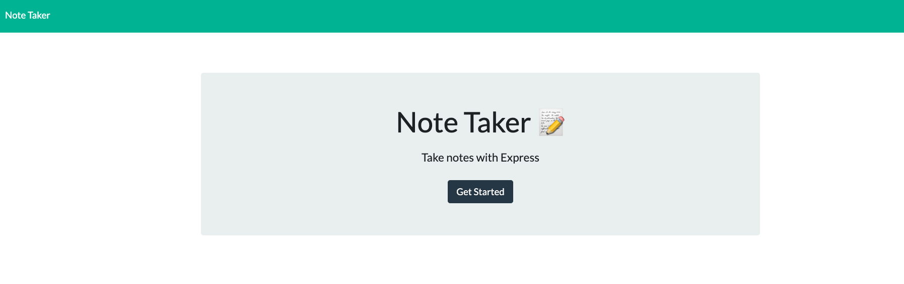
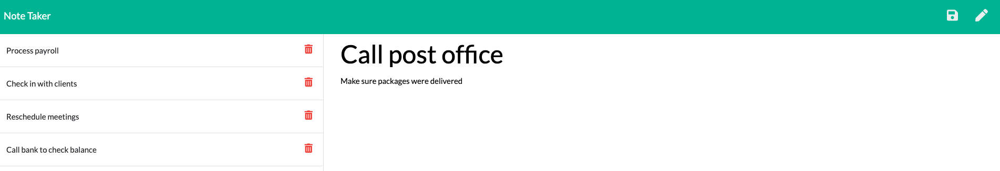

# Note Taker

Follow this link to the deployed application on Heroku! [Click to take notes!](https://melissadaskanotetaker.herokuapp.com/)

## Table of Contents
  
* [Purpose](#purpose)
* [Description](#description)
* [Questions](#questions)

## Purpose

This application will use an Express.js back end and save and retrieve note data from a JSON file.

## Description

AS A small business owner   
I WANT to be able to write and save notes  
SO THAT I can organize my thoughts and keep track of tasks I need to complete.  

Here is a screenshot of the home page: 

Here is a screen displaying the notes after the user adds each note:

## Questions
If you have any questions, you can reach me by emailing [melissa.daska@gmail.com](mailto:melissa.daska@gmail.com) or follow the link to my gitHub profile [melissadaska](https://github.com/melissadaska).
